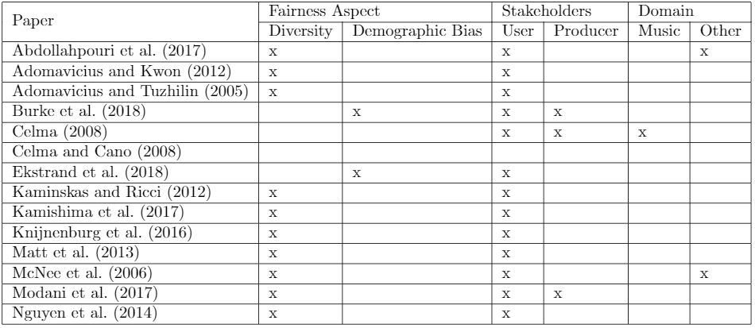
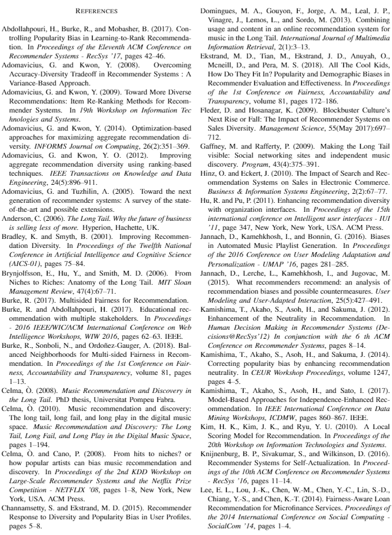
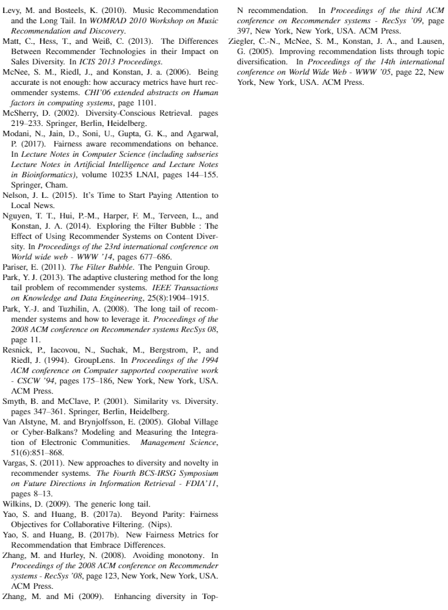

@snap[north]
@size[1.5em](Diversity and Demographic Bias in Recommender Systems with a Focus on the  Music Industry)
@snapend

@snap[south]
@css[byline](Maaike Visser, Robin Cromjongh and Cedric Willekens)
@snapend

Note:
  - Summary of the introduction
    - Recommender systems have become more and more popular since everything is going more and more online. A lot of these systems focus on metrics such as accuracy. Lately a lot of research has switched to a more social aspect, investigating the fairness of these systems. We want to therefore investigate the efforts that haver been made to combat unfairness in these recommender systems. Specifically with respect to demograpic biases and diversity. 

    - This paper is not so much computer science oriented??

---

@snap[west span 30]
Research questions
@snapend

@snap[east span-50]
@ol
- What efforts have been made by the community to increase fairness in recommender systems?
- What efforts have been made to increase fairness in music recommender systems in particular?
@olend
@snapend

note: 
  - Our first research question is: .... 
    - sub divided in diversity and demographic biases. 
  - Our second research question is...  

---

@snap[west span-45]
What our paper covers
@snapend

@snap[east text-white span-50]

@ol
- Recommender Systems
- Fairness in Recommender Systems
- Fairness in music recommender systems
- Conclusion and recommendations
@olend

@snapend

---

## Recommender Systems

note: 
  - so before we can talk about rec syss we need to talk about what kind of systems there exist and how they work. The 3 main ones are content based approach, collaborative approach and the hybrid approach. We will start of with the content based approach. 

+++ 

### Content based approaches

@ul
- Recommend items similar to those the user has already expressed interest towards
- features to compare these items with are difficult to extract
- danger of overspecialization
@ulend
+++ 

### Collaborative approaches

@ul[spaced-list-items]
- Recommendations based on items peer users have rated
- Cold start problem  
  + Sub-optimal recommendations for new users
  + Missing ratings for new items
- Danger of overspecialization
@ulend
+++ 

### Hybrid approaches

@ul[spaced-list-items]
- Implementation combines collaborative and content based approach
  - Incorperate some content based characteristics into collaborative approaches
  - Incorperate some collaborative appraoches characteristics into content based approaches
  - Construct a model which unifies content and collaborative approaches.
@ulend

note: 
  - The idea is that we combine collaborative and content based approaches. This can be done in 4 ways. first way ... 

---

### Fairness in Recommender Systems

note: 
  - Fairness of rec sys has recently gained more attation. This is a tricky measurement because it has many aspects. In our paper we considered fairness in diversity and demograhpic biases. Furthermore we also looked at not only the fairness towards the user but also towards the producer. 

+++ 

### Diversity
@ul
- Filter bubbles
  - Causes narrowing of preferences 
  - Bubbles will form with people with exact same preference
  - Users will be less satisified 
  - Producers who are not in this filter bubble will have a limited amount of sales
- Popularity bias
  - Items which are already popular will get more recommendations (rich-get-richer)
@ulend

+++ 

### Demographic Biases

@ul
- Occurs when a recommender systems behaves differently for different groups
- People in minority groups will drift futher apart 
@ulend

+++

@snap[west span-20]
The Table
@snapend

@snap[east span-80]

@snapend

note: 
  - Collecting all the literature we have read for this paper we have created a table to indicate which topic each of these papers cover. Our findings from this table will be discussed in the next section. 

--- 
### Fairness in music recommender systems
<!-- @size[0.5em](Fairness in music recommender systems) -->

@ul
- A small fraction of the research done considers fairness in music recommender systems
- No focus on producers or on demographic biases
- Lot of research about increasing diversity, but not about the effect on the producers
@ulend

note: 
  - From the table we can see that there is only a limited number of papers (5) considers fairness for music recommender systems. Furthermore none of these 5 papers focus on the music producers or on demograhpic biases. This means that the papers about music mainly cover the topics of diversity, but not how this effects the producer. 

---

### General Conclusions

@ul
- Limited amount of research done on demographic bias compared to diversity
- Most papers do not explicitly consider producers
- There is a lack of research into music potentially due to a lack of available databases. 
@ulend

--- 

### Recommendations

@ol
- Collect more anonymous datasets
- Look into the effects of current recommender systems on producers
- Look into the existence of demographic bias
- Examine the effect of recommender systems on fiarness in the music industry
@olend

---

---

@snap[west span-50]

@snapend

@snap[east span-50]

@snapend

---

@snap[top]
Questions?
@snapend

