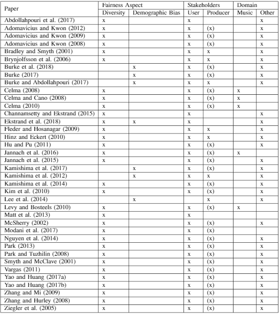

@snap[north]
@size[2.0em](Diversity and Demographic Bias in Recommender Systems)
@snapend

@snap[south]
@css[byline](Maaike Visser, Robin Cromjongh and Cedric Willekens)
@snapend

Note:
  - Summary of the introduction
    - Recommender systems have become more and more popular since everything is going more and more online. A lot of these systems focus on metrics such as accuracy. Lately a lot of research has switched to a more social aspect, investigating the fairness of these systems. We want to therefore investigate the efforts that haver been made to combat unfairness in these recommender systems. Specifically with respect to demograpic biases and diversity. 

    - This paper is not so much computer science oriented??

---

@snap[west span 30]
Research questions
@snapend

@snap[east span-50]
@ol
  - What efforts have been made by the community to increase fairness in recommender systems?
  - What efforts have been to increase fairness in music recommender systems in particular?
@olend
@snapend

note: 
  - Our first research question is: .... 
    - sub divided in diversity and demographic biases. 
  - Our second research question is...  

---

@snap[west span-45]
What our paper covers
@snapend

@snap[east text-white span-50]

@ol
  - Recommender Systems
  - Fairness in Recommender Systems
  - Fairness in music recommender systems
  - Conclusion and recommendations
@olend

@snapend

---

## Recommender Systems

note: 
  - so before we can talk about rec syss we need to talk about what kind of systems there exist and how they work. The 3 main ones are content based approach, collaborative approach and the hybrid approach. We will start of with the content based approach. 

+++ 

### Content based approaches

@ul
  - Recommend items similar to those the user has already expressed interest towards
  - features to compare these items with are difficult to extract
  - danger of overspecialization
@ulend
+++ 

### Collaborative approaches

+++ 

### Hybrid approaches

---

## Fairness in Recommender Systems

+++ 

### Diversity

+++ 

### Demographic Biases

+++

### The Table

--- 

## Research into music recommender systems

@snap[top-left]
@fa[fas fa-music]
@snapend

--- 

## Conclusion

--- 

---

@snap[top]
Questions?
@snapend

